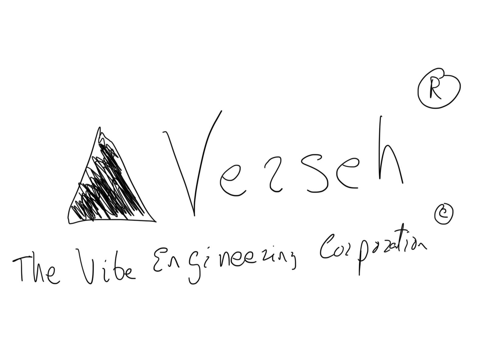

# verseh
Containerization of a Vercel like network architecture for penetration testing and defence purposes.
This project is created in the context of course "Cybersecurity in new generation applications and new telematic services" in the ETSI Informatics of University of Málaga.

The project authors are the developers of The Vibe Engineering Corporation :copyright:

  
   
  <em>My shitty ass copyrighted logo (Tanned Balls Certified)</em>

